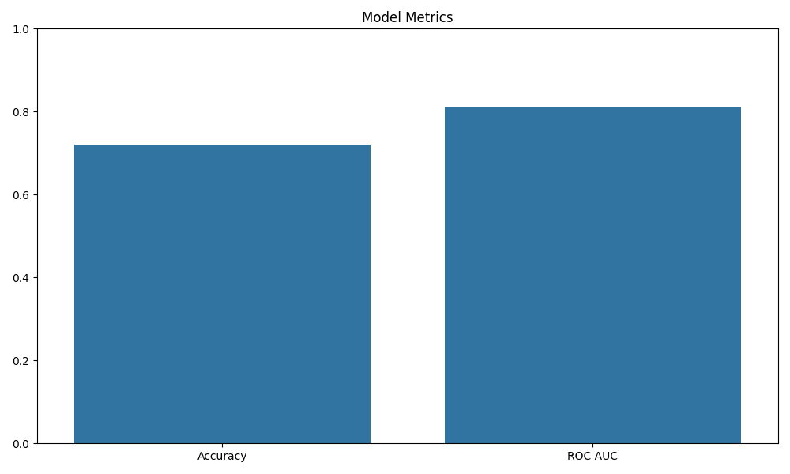

#  Diabetes Prediction Web App

A machine learning-powered Streamlit web app that predicts the likelihood of diabetes based on input health parameters. Built using the Pima Indians Diabetes dataset and trained with a Random Forest Classifier.



---

##  Features

-  Interactive sliders to input health data
-  Uses a trained Random Forest model
-  Predicts diabetes likelihood instantly
-  Displays model performance (Accuracy, ROC AUC)
-  Includes ROC curve and accuracy visualization
-  Model is pre-trained and stored as `.pkl`

---

##  Project Structure

diabetes-predictor/

├── diabetes_app.py              # Streamlit app

├── train_model.py               # Model training script

├── diabetes_model.pkl           # Trained ML model

├── metrics_plot_accuracy.png    # Accuracy + ROC AUC plot

├── metrics_plot_roc.png         # ROC curve

├── diabetes.csv                 # Dataset

├── requirements.txt             # Dependency list

└── README.md                    # Documentation


---

##  Dataset

The app uses the [Pima Indians Diabetes Dataset](https://www.kaggle.com/datasets/uciml/pima-indians-diabetes-database), which contains 768 rows and 8 health features:

- Pregnancies
- Glucose
- BloodPressure
- SkinThickness
- Insulin
- BMI
- Diabetes Pedigree Function
- Age

---

##  Tech Stack

- Python 3
- Streamlit
- scikit-learn
- pandas, numpy
- matplotlib, seaborn
- joblib (for model persistence)

---

##  Installation

### Clone the repo

```bash
git clone https://github.com/Sahil130202/diabetes-predictor.git
cd diabetes-predictor

### Install dependecies
pip install -r requirements.txt

### Run the app locally
streamlit run diabetes_app.py 

